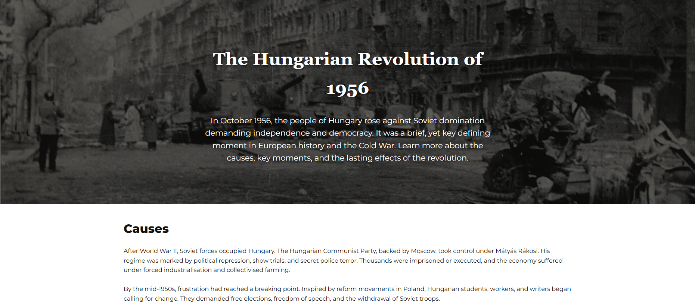
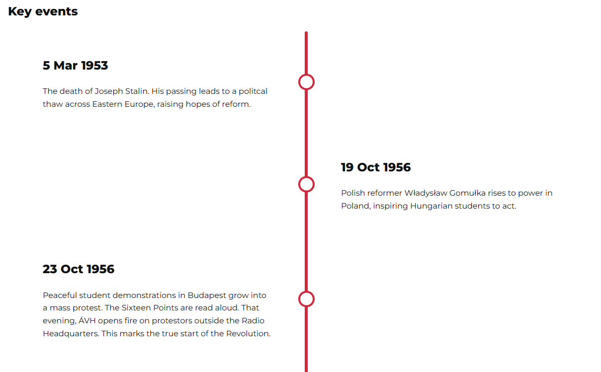
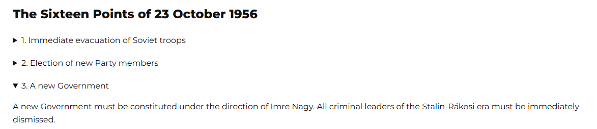
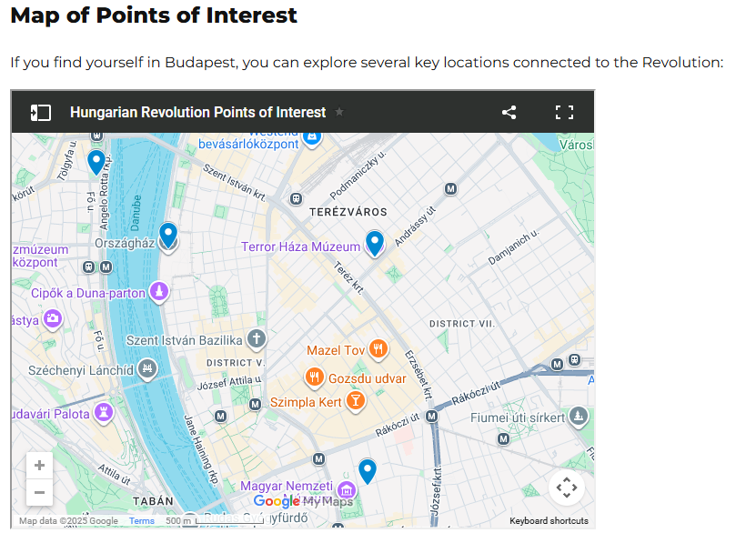

# The Hungarian Revolution of 1956
*Full stack development course - Project 1*

---

## Overview
This website is an educational resource explaining the causes, key events, and aftermath of the Hungarian Revolution of 1956. 
It's aim is to inform students or other interested parties about a pivitol moment in the Cold War in a clear way. 

Content is designed to flow naturally, allowing users to easily follow the information and find sections they are interested in. 

## Features
- __Navigation Bar__

The navigation bar is included on every page and includes links to the Home page, Summary page, Causes page, Revolution page, Aftermath page, and Additional Resources page. It will always show at the top of the view to allow users to easily navigate the website. 

- __Hero elements__

Each page other than Additional Resources contains a 'hero element' with a background image, a title, and summary text. These are used to grab readers' attention from the start of each page. 

- __Timeline__

The timeline of key events provides an easy to digest summary of the key events of the Hungarian Revolution.

- __Expandable information__

For long lists, headers can be expanded to provide readers with additional information, whilst avoiding clutter on pages.

- __Google Map with points of interest__

There is a Google Map iframe on the Additional Resources page that shows users key areas of interest they can visit in Budapest.

## Site Structure

| Page | Description |
| -----|-------------|
| **Home ('index.html')** | Introduces the website and includes tiles that link to the other pages. |
| **Summary and key events ('summary.html')** | Provides a concise overview of the Revolution, and a timeline of key events. |
| **Causes ('causes.html')** | Describes the political repression and economic hardship leading up to the Revolution. |
| **Revolution ('revolution.html')** | Details the outbreak of the uprising, including the revolutionaries 'Sixteen Points' in collapsible bullet points. |
| **Aftermath ('aftermath.html')** | Explains the results and reforms following the suppression of the Revolution, including an emedded video. |
| **Resources ('resources.html')** | Offers links for users to learn more, such as books and archives. Includes an emedded Google Maps iframe with key locations in Budapest related to the Revolution. |

## Deployment Procedure
All changes should be pushed to GitHub with a useful commit message. Pushes should be small, focusing on one area or change at a time. 

The GitHub repository for this site is:
https://github.com/gibba42/full_stack_development_project1

The website is hosted publically on GitHub. The link to the index page is:
https://gibba42.github.io/full_stack_development_project1/index.html

To run the website locally, clone the following repository:
git clone https://github.com/gibba42/full_stack_development_project1.git

## Bugs and Fixes

| Bug | Cause | Fix |
|-----|-------|-----|
| Timeline circles misaligned | Incorrect `top` CSS value | Adjusted `transform: translateY(-50%)` |
| Horizontal scroll bar | Page width exceeded viewport | Added `overflow-x: hidden` to `body` |
| Tile text compressed | Missing grid alignment | Added `.tile-content { display: grid; align-content: center; }` |
| Images and videos were taking up too much space on pages | Missing 'max-height CSS value | Added 'max-height: 600px: to 'img' and 'video' |
| Images and videos were misaligned with other content on pages | Images and videos were not positioned based on 'content' container | Moved 'img' and 'video' css rules under '.content' |
| GitHub repository was struggling to process all changes | Repository was set up incorrectly, the .git folder was created at the Desktop level | Ran git init at the correct level (within the project folder) and then flattened the folder structure to clean empty folders |

One outstanding bug remains unfixed. The video on the aftermath page remainings unchanged for 4 seconds after pressing play. This is not a bug with playback, but an issue with the file. There are 4 seconds that should be cut from the start of the video, and this should be trimmed with the appropriate editing tool. 

### Manual Testing

| Test | Expected Outcome | Result |
|------|-------------------|--------|
| Navigation links | Load correct pages | Passed |
| Expandable tiles | Expand and show additional text | Passed |
| External links | Open in new tab | Passed |
| Video playback | Controlled by user | Passed |
| Timeline | Alternates correctly | Passed |
| Collapsible “Sixteen Points” | Expands smoothly | Passed |
| Google Maps iframe | Shows points of interest | Passed |